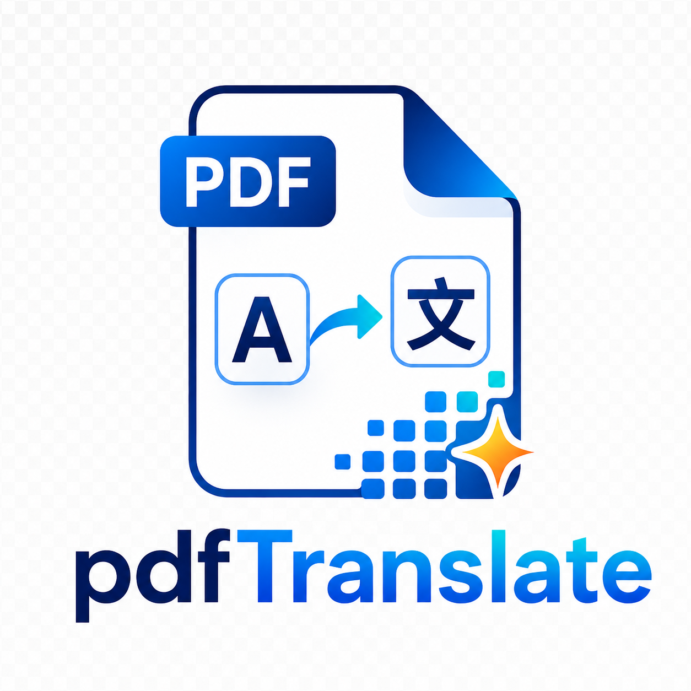

# pdfTranslate

<p align="center">
  
</p>

一个实验中的 PDF 翻译工具。当前阶段先不做 AI 翻译，而是把普通文本型 PDF 解析成稳定的中间结构 `LayoutConfig`，并逐步验证原样 PDF 重建能力，为后续接入 AI 翻译做准备。

## 当前能力

- `extract`：用 PDFium 提取 PDF 文本并输出 Markdown。
- `parse-layout`：用 Docling 解析 PDF 文件或目录，并输出 JSON 格式的 `LayoutConfig`；当 Docling 检出表格或公式时，会输出 `table` / `formula` block，默认也会按版面区域生成图片资产。
- `extract-images`：按已有 `LayoutConfig` 中的图片/表格/公式区域从原 PDF rasterize 图片资产，并把 `asset_path` 写回增强版 `LayoutConfig`。
- `translate-layout`：读取 `LayoutConfig`，只翻译可翻译文本块，默认输出中文译文到 `translated_text`。
- `render-layout`：用 `LayoutConfig` 重建 PDF；文本块有 `translated_text` 时会优先绘制译文，并进行 bbox 内换行、字号收缩和 overflow 标记；图片块有有效 `asset_path` 时会回填真实图片，否则保留占位框；表格和公式当前以可调试占位框渲染。
- 默认不处理扫描版 PDF，也不会开启 OCR。
- 目前不会翻译图片内容，也不会编辑图片本身。

## 安装依赖

项目使用 `uv` 管理依赖：

```bash
uv sync
```

如果是第一次运行 Docling，它可能会下载模型文件，首轮解析会慢一些。

## 使用方式

### Codex 插件使用

#### 给自己本地使用

先安装依赖并确认 Codex CLI 已登录：

```bash
uv sync
codex login
```

然后在仓库根目录添加本地 marketplace：

```bash
codex plugin marketplace add .
```

重新打开 Codex workspace 后，启用 `pdfTranslate Codex`。之后可以直接对 Codex 说：

```text
Use pdfTranslate Codex to translate ./assets/1603.08767v1.pdf to Chinese and write the PDF to ./output/pdf.
```

```text
用 pdfTranslate Codex 翻译 ./paper.pdf，输出到 ./translated/pdf，翻译完成后删除临时文件。
```

#### 给别人从 GitHub 安装

发布到 GitHub 后，用户可以把这个仓库添加为 Codex plugin marketplace：

```bash
codex plugin marketplace add hujianbo/pdfTranslate
```

也可以用完整 Git URL：

```bash
codex plugin marketplace add https://github.com/hujianbo/pdfTranslate.git
```

如果你发布了 tag，建议让用户固定版本：

```bash
codex plugin marketplace add hujianbo/pdfTranslate --ref v0.1.0
```

#### 命令行一键翻译

```bash
uv run python plugins/pdftranslate-codex/scripts/translate_pdf_with_codex.py \
  assets/1603.08767v1.pdf \
  --output-dir output/pdf \
  --target-language zh
```

常用参数：

- `--output <pdf>`：指定完整输出 PDF 路径。
- `--output-dir <dir>`：指定输出目录，默认文件名为 `<pdf-name>.zh.pdf`。
- `--output-layout <json>`：额外保留翻译后的 `LayoutConfig`。
- `--work-dir <dir>`：指定中间文件目录。
- `--keep-work-dir`：保留中间文件和日志；默认完成后删除。
- `--no-images`：跳过图片/表格/公式区域 rasterize。
- `--debug-boxes`：输出调试框，方便检查排版。
- `--batch-size` / `--batch-chars`：控制翻译批次大小。
- `--codex-model <model>`：指定 `codex exec` 使用的模型。

### 推荐：手动翻译工作流

当前可以先跳过真实翻译接口，用两条高层命令跑通“解析 -> 手动翻译 -> 重建 PDF”：

默认临时产物会放在 `tmp/layout`、`tmp/assets` 和 `tmp/pdf` 下；如果需要，也可以通过命令行参数改掉。

```bash
uv run pdftranslate parse-layout assets \
  --output tmp/layout \
  --assets-dir tmp/assets
```

如果传入的是目录，命令会处理目录下的 `*.pdf`；如果传入的是单个 PDF，则只处理该文件。输出文件名为：

```text
tmp/layout/<pdf-name>.layout.json
```

同时会按图片/表格/公式区域生成 PNG 资产，并把 `asset_path` 写成相对 layout 文件所在目录的路径，后续换目录执行也更稳。

你可以把完成中文译文的 layout 命名为：

```text
tmp/layout/<pdf-name>.zh.layout.json
```

然后生成最终 PDF：

```bash
uv run pdftranslate build-pdf tmp/layout/<pdf-name>.zh.layout.json \
  --output-dir tmp/pdf
```

默认情况下，`build-pdf` 会要求所有 `translatable=true` 的 text block 都有非空 `translated_text`。如果只是调试半成品 layout，可以加：

```bash
uv run pdftranslate build-pdf tmp/layout/<pdf-name>.zh.layout.json \
  --output-dir tmp/pdf \
  --allow-missing-translations \
  --debug-boxes
```

底层命令仍然保留，适合单步排查问题。

### 1. 提取 Markdown 文本

```bash
uv run pdftranslate extract assets/1603.08767v1.pdf --output sample.md
```

输出文件是普通 Markdown，适合快速查看 PDF 里的文本内容。

### 2. 解析 LayoutConfig

```bash
uv run pdftranslate parse-layout assets/1603.08767v1.pdf --output assets/1603.08767v1.layout.json
```

输出文件是 JSON，里面包含页面尺寸、文本块、图片块、表格块、公式块、坐标和基础样式占位信息。后续 AI 翻译阶段会优先消费这个结构，而不是直接消费 Docling 的内部对象。

一个简化后的输出形状如下：

```json
{
  "schema_version": "1.0",
  "source_file": "assets/1603.08767v1.pdf",
  "coordinate_system": {
    "unit": "pt",
    "origin": "bottom-left"
  },
  "pages": [
    {
      "page_number": 1,
      "width": 612.0,
      "height": 792.0,
      "rotation": 0,
      "blocks": [
        {
          "id": "p1_b1",
          "kind": "text",
          "page_number": 1,
          "text": "Original text",
          "bbox": {
            "x0": 72.0,
            "y0": 100.0,
            "x1": 200.0,
            "y1": 124.0
          },
          "style": {
            "font_name": null,
            "font_size": null,
            "color": null,
            "rotation": 0
          },
          "translatable": true
        },
        {
          "id": "p1_i1",
          "kind": "image",
          "page_number": 1,
          "bbox": {
            "x0": 72.0,
            "y0": 220.0,
            "x1": 240.0,
            "y1": 340.0
          },
          "image": {
            "ref": "p1_i1",
            "width": 168.0,
            "height": 120.0,
            "mime_type": null,
            "asset_path": "output/assets/1603.08767v1/images/p1_i1.png"
          }
        },
        {
          "id": "p1_t1",
          "kind": "table",
          "page_number": 1,
          "bbox": {
            "x0": 72.0,
            "y0": 300.0,
            "x1": 540.0,
            "y1": 520.0
          },
          "table": {
            "num_rows": 2,
            "num_cols": 2,
            "cells": [
              {
                "text": "Header",
                "row_start": 0,
                "row_end": 1,
                "col_start": 0,
                "col_end": 1,
                "row_span": 1,
                "col_span": 1,
                "column_header": true,
                "row_header": false
              }
            ]
          }
        },
        {
          "id": "p1_f1",
          "kind": "formula",
          "page_number": 1,
          "bbox": {
            "x0": 180.0,
            "y0": 420.0,
            "x1": 432.0,
            "y1": 456.0
          },
          "formula": {
            "text": "E=mc^2",
            "ref": "#/texts/1"
          },
          "translatable": false
        }
      ],
      "warnings": []
    }
  ]
}
```

表格和公式字段约定：

- `kind`: `table` 表示表格块，bbox 覆盖 Docling 识别到的表格区域。
- `table.num_rows` / `table.num_cols` 保存表格行列数。
- `table.cells` 保存单元格文本、行列范围、跨行跨列、表头标记和可选单元格 bbox。
- `kind`: `formula` 表示公式块，默认保护为非普通翻译文本。
- `formula.text` 保存 Docling 提供的公式文本；如果没有可用文本，`formula.ref` 保存来源引用。
- `translatable`: `false` 表示公式块不会被当作普通文本块翻译。

完整字段说明见：

```text
openspec/specs/pdf-layout-config/spec.md
```

### 3. 提取图片资产并写回 LayoutConfig

`parse-layout` 默认已经会生成图片资产。只有在你已有 layout JSON，想单独重新生成或写回 assets 时，才需要运行图片资产提取：

```bash
uv run pdftranslate extract-images assets/1603.08767v1.pdf \
  --layout assets/1603.08767v1.layout.json \
  --output-layout output/layout/1603.08767v1.with-images.layout.json \
  --assets-dir output/assets/1603.08767v1/images
```

这个命令会：

- 按 layout 中的图片/表格/公式 bbox 从原 PDF rasterize PNG 资产。
- 保存到 `--assets-dir` 指定的目录。
- 按 block id 写回对应的 `image.asset_path`、`table.asset_path` 或 `formula.asset_path`。
- 在增强版 layout JSON 中写入相对 `--output-layout` 所在目录的资产路径。

如果某个区域无法 rasterize，会保留原有 `ref`、尺寸和 `mime_type`，后续渲染时仍显示占位框。

### 4. 翻译 LayoutConfig 文本块

没有真实模型 key 时，可以先用 mock provider 跑通链路：

```bash
uv run pdftranslate translate-layout output/layout/1603.08767v1.with-images.layout.json \
  --output output/layout/1603.08767v1.translated.layout.json \
  --provider mock
```

mock provider 会生成确定性的中文样例译文，便于验证 `translated_text`、重建和 debug PDF 流程。

真实翻译默认使用 `--provider openai`。这里的 openai provider 指 OpenAI-compatible 接口，只在翻译命令中读取项目根目录 `.env` 或环境变量：

```dotenv
BASE_URL=https://your-openai-compatible-endpoint/v1
KEY=your-api-key
MODEL=your-model-name
```

也兼容标准变量：

```bash
export OPENAI_BASE_URL="https://api.openai.com/v1"
export OPENAI_API_KEY="your-api-key"
export OPENAI_MODEL="gpt-4o-mini"
```

`.env` 中的 `BASE_URL`、`KEY`、`MODEL` 只用于 `translate-layout` / `translate-pdf` 的 OpenAI-compatible provider。`parse-layout`、`extract-images` 和 `render-layout` 不读取这些翻译配置。如果没有 `KEY` 或 `OPENAI_API_KEY`，请使用 `--provider mock`、先配置 key，或通过 Codex plugin adapter 接入 `codex` provider。

运行真实 provider：

```bash
uv run pdftranslate translate-layout output/layout/1603.08767v1.with-images.layout.json \
  --output output/layout/1603.08767v1.translated.layout.json \
  --provider openai
```

如果想用 Codex 自己翻译 PDF，请直接使用上面的“Codex 插件使用”。

### 5. 用 LayoutConfig 重建 PDF

```bash
uv run pdftranslate render-layout output/layout/1603.08767v1.translated.layout.json \
  --output output/pdf/1603.08767v1.translated.rebuilt.pdf \
  --require-translations \
  --debug-boxes
```

如果 layout 里的 `image.asset_path` 不是相对 layout 文件所在目录的路径，可以用 `--asset-base-dir` 指定图片路径解析基准：

```bash
uv run pdftranslate render-layout output/layout/1603.08767v1.translated.layout.json \
  --output output/pdf/1603.08767v1.translated.rebuilt.pdf \
  --require-translations \
  --asset-base-dir .
```

最终导出翻译版 PDF 时建议加 `--require-translations`。该选项会检查所有 `translatable=true` 的文本块都包含非空 `translated_text`；如果缺失译文，命令会在生成 PDF 前失败，并在 stderr 中列出缺失的 block id。调试半成品 layout 时可以不加这个选项，渲染器会继续使用原文或样本文本回退规则。

当文本块包含 `translated_text` 时，渲染器会优先使用译文，并尝试在原 bbox 内做中文友好的换行。如果默认字号放不下，会逐步缩小字号；仍然放不下时会标记 overflow。开启 `--debug-boxes` 后，overflow 文本块会显示额外的红色 `overflow` 标记，方便定位仍需人工或后续重排处理的区域。

调试中文样本文本可以加：

```bash
uv run pdftranslate render-layout output/layout/1603.08767v1.with-images.layout.json \
  --output output/pdf/1603.08767v1.with-images.rebuilt.zh.pdf \
  --sample-text zh \
  --debug-boxes
```

当前重建目标是验证页面尺寸、坐标方向、文本块位置、译文在 bbox 内的基本可读性、图片大体位置，以及表格/公式占位框是否覆盖正确区域。表格边框、公式排版、矢量图形、跨 block 段落合并和 BabelDOC 级别的复杂重排还没有进入稳定重建阶段。

## 当前设计为什么代码不多

这一步已经改成 Docling-first。也就是说，PDF 解析、版面识别、文本块和图片项发现这些复杂能力主要由 Docling 完成，本项目现在只做几件很关键但很薄的事情：

- 配置 Docling，并默认关闭 OCR。
- 把 DoclingDocument 映射成自己的 `LayoutConfig`。
- 生成稳定 ID，例如 `p1_b1`、`p2_i1`。
- 固定坐标系和 JSON 契约，避免后续翻译、排版、PDF 重建直接依赖 Docling 内部结构。
- 保留旧的 PDFium Markdown 提取命令，方便快速调试文本。

所以代码少不是缺功能，而是把当前阶段的边界收窄了：先拿到可靠的结构化 layout，再继续做 AI 翻译和原样 PDF 回填。

## 当前限制

- 只面向普通文本型 PDF。
- 扫描版 PDF/OCR 暂不支持。
- style 目前只保留字段占位，无法可靠取得的值为 `null`。
- 图片资产提取只覆盖 PDF 中可直接提取的 raster image；矢量图仍可能显示为占位或普通文本块。
- 表格和公式依赖 Docling 的识别结果；当前会进入 `LayoutConfig`，但重建 PDF 时仍以占位框表示，还不会恢复表格边框、公式字体或数学排版细节。
- 已有 provider-based 文本翻译入口，但当前不翻译图片、公式和表格。
- 当前 PDF 重建仍是验证性输出，不保证像素级一致；译文会做 block 内换行和缩字号，但不会做段落级合并、跨页续排或全局碰撞检测。

## 测试

运行完整测试：

```bash
uv run python -m pytest -q
```

当前变更验证过的样例结果：

- `assets/1603.08767v1.pdf` 可解析为 `LayoutConfig`
- 样例输出包含 `12` 页、`214` 个文本块、`3` 个图片块
- 旧 `extract` 命令仍可生成 Markdown
